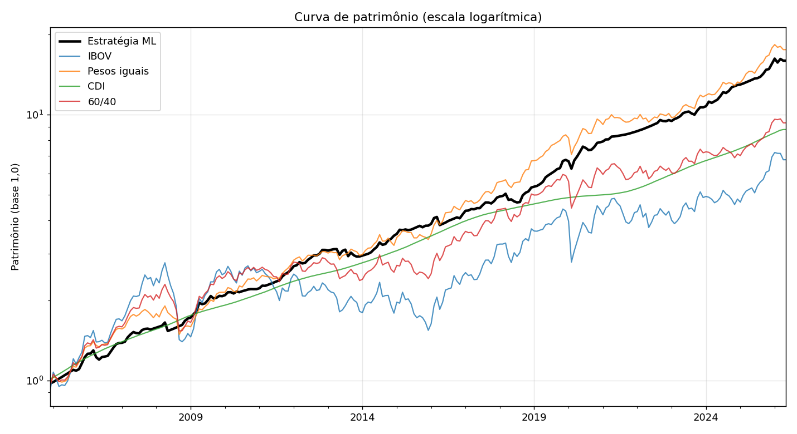
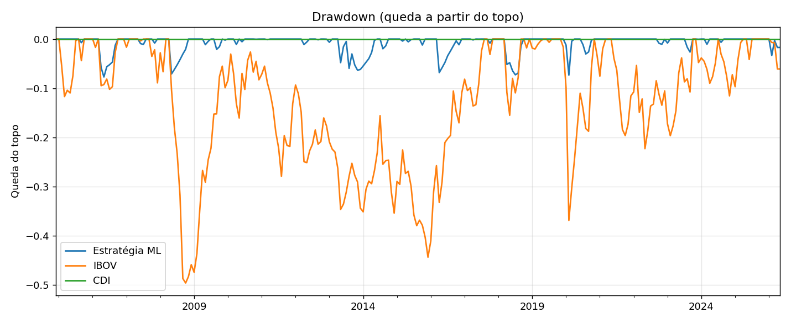
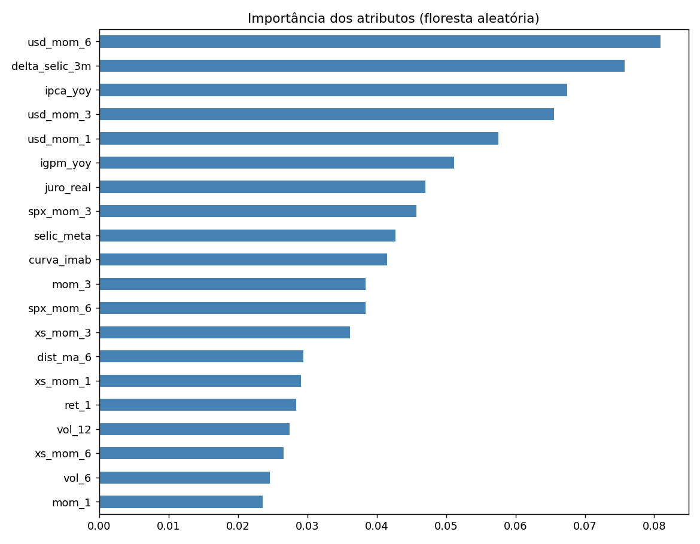

# Alocação Sistemática em Classes de Ativos com Aprendizado Supervisionado

Estratégia quantitativa que decide, **mês a mês**, quanto alocar em cada classe de
ativo (ações, renda fixa, ouro, dólar) em vez de ficar no caixa (CDI/Selic). Um
modelo de aprendizado supervisionado estima a **probabilidade de cada classe bater
o CDI** no mês seguinte, e essa probabilidade vira o tamanho da posição.

> Trabalho 2 da disciplina SSC0964 - Introdução à Computação no Mercado Financeiro (ICMC USP).



## A ideia em uma frase

Em vez de uma regra técnica sobre uma única série (médias móveis, Bandas de
Bollinger), o problema é tratado como classificação: para cada ativo e cada mês,
*"vale a pena estar aqui em vez de ficar no caixa?"*. A resposta (uma probabilidade)
dimensiona o peso na carteira.

**O que torna a estratégia original:**

- **Saída:** probabilidade de superar o CDI, não "sobe/desce".
- **Entrada:** mistura sinais técnicos (momentum, volatilidade, reversão) com
  contexto macro (juro real, Selic, inflação IPCA/IGP-M, dólar, bolsa global).
- **Decisão sobre 8 classes ao mesmo tempo**, ganhando largura de apostas.

## Resultados (jan/2005 a mai/2026, fora da amostra)

| Carteira | Retorno a.a. | Volatilidade | Sharpe | Drawdown máx. |
|---|---|---|---|---|
| **Estratégia (Floresta Aleatória)** | **13,8%** | **7,0%** | **0,43** | **-7,7%** |
| Ibovespa | 9,3% | 22,1% | 0,06 | -49,6% |
| CDI | 10,7% | 1,0% | — | 0,0% |
| 60/40 | 11,0% | 14,8% | 0,09 | -33,3% |

Retorno parecido com o de ações, mas com risco perto do da renda fixa: o drawdown
máximo foi de apenas **-7,7%**, contra **-49,6%** do Ibovespa.



## Como funciona

| Etapa | O que faz |
|---|---|
| **Dados** | Índices mensais de dez/1999 a mai/2026 (8 classes + macro). |
| **Features** | 34 atributos: técnicos por ativo + macro compartilhado. |
| **Rótulo** | 1 se o ativo bate o CDI no mês seguinte, senão 0 (sem lookahead). |
| **Modelos** | Logística, Floresta Aleatória, Gradient Boosting e MLP. |
| **Validação** | Walk-forward (treina só com o passado, prevê o mês seguinte). |
| **Alocação** | Peso ∝ convicção × (1/volatilidade), teto por ativo e piso em caixa. |
| **Custos** | 0,10% sobre o giro da carteira. |

O modelo aprendeu que o **regime macro** (dólar, Selic, inflação) é o que mais
define se uma classe bate o caixa, mais até do que os indicadores técnicos:



## Como rodar

```bash
pip install -r requirements.txt
cd src
python main.py            # treina tudo do zero
python main.py --cache    # reaproveita previsões (rápido)
```

Saídas (tabelas `.csv` e gráficos `.png`) vão para `outputs/`.

## Estrutura

```
src/          código (config, data, features, labels, model, walkforward, allocation, metrics, plots, main)
outputs/      gráficos e métricas gerados
relatorio/    relatório científico (PDF) e o gerador
context/      base de dados (v6-DB-Indices.xlsx)
```

## Limitações

O Ibovespa é índice de preço (sem dividendos), enquanto outras séries são de
retorno total; os custos são uma aproximação; e todo backtest reflete o passado,
sem garantir resultado futuro.

---

Autores: Bruno Garcia de Oliveira Breda e Vitor Antonio de Almeida Lacerda.
